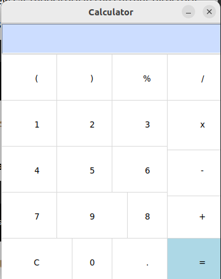

# Tkinter_Calculator

Simple Calculator Application

This is a basic calculator application built using Python's Tkinter library. It provides a graphical user interface (GUI) to perform basic arithmetic operations such as addition, subtraction, multiplication, and division.

Features
Basic Arithmetic Operations: Supports addition, subtraction, multiplication, and division.

GUI Interface: Built with Tkinter, providing a user-friendly interface for calculations.

Responsive Buttons: Includes buttons for digits, arithmetic operations, parentheses, and special functions like clear ('C') and equals ('=').

Input Display: Shows the current input and results in a display area at the top of the calculator.

Usage
Entering Numbers and Operators: Click the buttons on the calculator interface to enter numbers and operators.

Performing Calculations: After entering the desired equation, click the '=' button to see the result.

Clearing Input: Use the 'C' button to clear the current input and start a new calculation.

If you'd like to contribute to this project, feel free to fork the repository and submit a pull request. Suggestions and improvements are welcome!